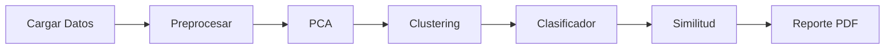
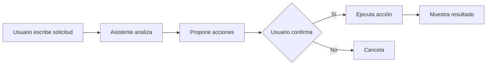

<p align="center">
  
</p>

<h1 align="center">
  <br>
  Chemometrics Helper
  <br>
</h1>

<h4 align="center">Sistema Interactivo de Análisis Multivariado para Datos Químicos</h4>

<p align="center">
  
  
  
  
  
  
</p>

<p align="center">
  <strong>Proyecto Académico | Tecnológico de Monterrey | Métodos Multivariados en Ciencia de Datos</strong>
</p>

<p align="center">
  <a href="#características">Características</a> •
  <a href="#instalación">Instalación</a> •
  <a href="#uso">Uso</a> •
  <a href="#api">API</a> •
  <a href="#autores">Autores</a>
</p>

---

## Descripción

**Chemometrics Helper** es una aplicación web interactiva diseñada para estudiantes y profesionales de química que permite realizar análisis de componentes principales (PCA), clustering, clasificación supervisada y búsqueda de similitud química — todo sin necesidad de programar.

La aplicación incluye un **modo enseñanza** integrado que guía al usuario paso a paso, explicando cada técnica y cómo interpretar los resultados.

---

## Características

<table>
<tr>
<td width="50%">

### Análisis Multivariado
- **PCA** con scores, loadings y biplot
- **Diagnóstico PCA** con Hotelling T² y Q-residuals
- **Auto-optimización** de número de componentes
- **Clustering** K-means y jerárquico
- Visualizaciones interactivas 2D y **3D**
- Exportación de resultados CSV

</td>
<td width="50%">

### Machine Learning
- **Clasificador supervisado** (RF, SVM, LR)
- Predicción de feedstock y concentración
- Métricas y matriz de confusión
- Importancia de variables

</td>
</tr>
<tr>
<td width="50%">

### Fingerprinting Químico
- Búsqueda de muestras similares
- Métricas: euclidiana y coseno
- Visualización en espacio PCA
- Interpretación automática

</td>
<td width="50%">

### Reportes Automáticos
- Generación de PDF profesional
- Interpretaciones en español
- Resumen ejecutivo
- Gráficos incluidos

</td>
</tr>
<tr>
<td colspan="2">

### Mapa Químico 2.0
- Proyección avanzada con **PCA**, **t-SNE** y **UMAP**
- Detección y visualización de outliers
- Combinación de reducción dimensional con clustering
- Vista interactiva del "espacio químico"

</td>
</tr>
</table>

### Tour de Bienvenida

Onboarding automático que aparece **solo la primera vez** que el usuario abre la aplicación. Presenta las zonas clave de la interfaz:

1. **Bienvenida general** - Introducción a Chemometrics Helper
2. **Navegación principal** - Descripción de cada página (Análisis, Clasificador, Similitud, etc.)
3. **Modo Enseñanza** - Cómo activar el tutorial guiado
4. **Asistente Quimiométrico** - Chatbot integrado con IA
5. **Cierre** - Invitación a comenzar

**Características técnicas:**
- Usa la misma estética del Modo Enseñanza (overlay oscuro, borde azul animado)
- Se puede cerrar en cualquier momento con el botón X o tecla Escape
- Guarda en localStorage (`chemometrics_welcome_tour_seen`) para no volver a mostrarse
- Se puede reactivar desde la página de **Ayuda** con el botón "Ver tour de bienvenida"

### Modo Enseñanza

Tutorial guiado integrado que explica cada sección de la aplicación con overlays interactivos, ideal para aprender quimiometría paso a paso.

### Asistente Quimiométrico Virtual (Modo Copilot)

Chat inteligente integrado que utiliza **Google Gemini AI** para:
- Interpretar resultados de PCA, clustering y clasificación
- Explicar conceptos de quimiometría en español
- Responder preguntas sobre tu análisis específico
- **Preguntas sugeridas** adaptadas al modo de operación (IA/Demo)
- **Modo Copilot**: propone y ejecuta acciones (PCA, clustering, clasificador) tras confirmación del usuario

### Navegación Jerárquica

Interfaz organizada con **tabs principales** y **sub-tabs** para fácil acceso:

| Tab Principal | Sub-tabs |
|---------------|----------|
| **Datos** | Correlación |
| **PCA** | Varianza \| Scores \| Biplot \| Loadings |
| **Diagnóstico** | T² vs Q \| Optimización |
| **Visualización** | Mapa Químico \| 3D |
| **Clustering** | Clusters \| Silhouette |

---

## Diagnóstico Multivariado (Hotelling T², Q-residuals y Contribuciones)

El sistema incluye herramientas avanzadas de control de calidad para el análisis PCA:

### Hotelling T² (Distancia de Mahalanobis)
- Mide qué tan lejos está cada muestra del **centro del modelo** en el espacio de componentes principales
- Un T² alto indica que la muestra tiene características extremas en las direcciones capturadas por el modelo
- **Fórmula**: T²ᵢ = Σₐ (tᵢₐ² / λₐ) donde tᵢₐ son los scores y λₐ las varianzas de cada PC

### Q-Residual (SPE - Squared Prediction Error)
- Mide el **error de reconstrucción** de cada muestra
- Un Q alto indica que la muestra tiene variación que el modelo PCA no captura
- **Fórmula**: Qᵢ = ||xᵢ - x̂ᵢ||² donde x̂ᵢ es la reconstrucción desde los componentes retenidos

### Interpretación del Gráfico T² vs Q

| Zona | T² | Q | Significado |
|------|----|----|-------------|
| Normal | Bajo | Bajo | Muestra bien representada por el modelo |
| Alta variación explicada | Alto | Bajo | Valores extremos pero dentro del patrón normal |
| Estructura anómala | Bajo | Alto | Comportamiento diferente no capturado |
| **Outlier severo** | Alto | Alto | Anomalía completa - investigar causas |

### Contribuciones por Variable
Al hacer clic en una muestra outlier, el sistema calcula cuáles variables contribuyen más a su anomalía:
- Para **T²**: muestra qué variables causan la posición extrema en el espacio PCA
- Para **Q**: muestra qué variables tienen mayor error de reconstrucción

---

## Selección Automática de Número de Componentes

El sistema recomienda automáticamente el número óptimo de componentes usando tres criterios:

### 1. Criterio de Varianza Acumulada
- Busca el primer k donde la varianza acumulada alcanza el umbral (default: 90%)
- Configurable por el usuario

### 2. Método del Codo
- Analiza la curva de error de reconstrucción
- Encuentra el punto donde añadir más componentes aporta retornos decrecientes

### 3. Significancia Individual
- Cada componente debe explicar al menos 5% de varianza
- Evita retener componentes que solo capturan ruido

### Visualización
- **Gráfico de barras**: varianza explicada individual por cada PC
- **Línea naranja**: varianza acumulada
- **Línea roja**: error de reconstrucción normalizado
- **Línea verde**: k recomendado

---

## Visualización 3D & Mapa Químico 2.0

### Vista 3D de Scores
- Proyección interactiva de las muestras en el espacio PC1-PC2-PC3
- Rotación, zoom y desplazamiento con el mouse
- Coloreado por feedstock, concentración, cluster o diagnósticos (T²/Q)
- Implementado con **Plotly.js** para máxima interactividad

### Mapa Químico 2.0
Proyección avanzada 2D del "espacio químico" con tres métodos:

| Método | Descripción | Mejor para |
|--------|-------------|------------|
| **PCA** | Proyección lineal que preserva varianza global | Vista general, interpretabilidad |
| **t-SNE** | Proyección no lineal que preserva vecindarios locales | Revelar clusters naturales |
| **UMAP** | Balance entre estructura global y local | Visualización exploratoria |

El mapa muestra:
- Muestras coloreadas por categoría o cluster
- Outliers resaltados en rojo
- Información detallada en tooltips

---

## Stack Tecnológico

| Capa | Tecnologías |
|------|-------------|
| **Frontend** | React 18, TypeScript, Vite, TailwindCSS, Recharts |
| **Backend** | Python 3.10+, FastAPI, Pydantic |
| **ML/Data** | scikit-learn, pandas, numpy, scipy |
| **PDF** | ReportLab |
| **AI** | Google Gemini API (google-genai) |

---

## Instalación

### Requisitos Previos

- Python 3.10+
- Node.js 18+
- npm o yarn

### 1. Clonar el Repositorio

```bash
git clone https://github.com/yosebitasgg/analisis-quimiometrico.git
cd analisis-quimiometrico
```

### 2. Configurar Backend

```bash
cd backend

# Crear entorno virtual
python -m venv venv

# Activar (Windows)
venv\Scripts\activate

# Activar (Linux/Mac)
source venv/bin/activate

# Instalar dependencias
pip install -r requirements.txt
```

### 3. Configurar Asistente Virtual (Opcional)

Para activar el asistente con IA real, configura tu API key de Google AI Studio:

```bash
# Copiar el archivo de ejemplo
copy .env.example .env   # Windows
cp .env.example .env     # Linux/Mac

# Editar .env y agregar tu API key
GEMINI_API_KEY=tu-api-key-aqui
```

Obtén tu API key gratuita en: https://aistudio.google.com/apikey

> **Nota**: Sin la API key, el asistente funciona en **modo demo** con respuestas predefinidas sobre quimiometría.

### 4. Configurar Frontend

```bash
cd frontend

# Instalar dependencias
npm install
```

---

## Ejecución

### Terminal 1 - Backend

```bash
cd backend
venv\Scripts\activate
uvicorn app.main:app --reload --port 8000
```

### Terminal 2 - Frontend

```bash
cd frontend
npm run dev
```

### URLs

| Servicio | URL |
|----------|-----|
| **Aplicación** | http://localhost:5173 |
| **API Docs** | http://localhost:8000/docs |
| **API ReDoc** | http://localhost:8000/redoc |

---

## Uso

### Flujo de Trabajo Recomendado



### 1. Cargar Datos

- Sube un archivo CSV/Excel o usa el **dataset de ejemplo** (FAMEs)
- El sistema detecta automáticamente variables numéricas y categóricas

### 2. Preprocesamiento

- Selecciona las variables a analizar
- Configura el manejo de valores faltantes
- **Estandariza** los datos (recomendado para PCA)

### 3. Análisis PCA

- Calcula componentes principales
- Explora: Varianza, Scores, Loadings, Biplot, Correlación

### 4. Clustering

- Elige K-means o Jerárquico
- Usa el análisis de Silhouette para elegir k óptimo

### 5. Clasificador

- Entrena modelos para predecir feedstock/concentración
- Evalúa con matriz de confusión y métricas

### 6. Similitud

- Encuentra muestras con perfiles químicos parecidos
- Visualiza vecinos en el espacio PCA

### 7. Reporte

- Genera un PDF profesional con todas las interpretaciones

### 8. Asistente Virtual

- Haz clic en **"Asistente"** en el header para abrir el chat
- Pregunta sobre tus resultados de PCA, clustering o clasificación
- El asistente tiene acceso al contexto de tu análisis actual

---

## API

### Endpoints Principales

<details>
<summary><b>Datos</b></summary>

| Método | Endpoint | Descripción |
|--------|----------|-------------|
| `POST` | `/api/data/upload` | Subir archivo CSV/Excel |
| `POST` | `/api/data/cargar-ejemplo` | Cargar dataset de ejemplo |
| `POST` | `/api/data/preprocesar` | Aplicar preprocesamiento |
| `GET` | `/api/data/correlacion/{session_id}` | Matriz de correlación |
| `GET` | `/api/data/exportar/{session_id}` | Exportar CSV |

</details>

<details>
<summary><b>PCA</b></summary>

| Método | Endpoint | Descripción |
|--------|----------|-------------|
| `POST` | `/api/pca/calcular` | Ejecutar PCA |
| `GET` | `/api/pca/resultados/{session_id}` | Obtener resultados |
| `GET` | `/api/pca/diagnosticos/{session_id}` | Diagnósticos T² y Q-residuals |
| `POST` | `/api/pca/contribuciones` | Contribuciones por variable |
| `GET` | `/api/pca/optimizacion/{session_id}` | Auto-optimización de #PCs |
| `GET` | `/api/pca/proyeccion-3d/{session_id}` | Datos para vista 3D |
| `POST` | `/api/pca/mapa-quimico` | Mapa químico 2D (PCA/UMAP/t-SNE) |

</details>

<details>
<summary><b>Clustering</b></summary>

| Método | Endpoint | Descripción |
|--------|----------|-------------|
| `POST` | `/api/clustering/calcular` | Ejecutar clustering |
| `GET` | `/api/clustering/silhouette-analisis/{session_id}` | Análisis silhouette por k |
| `GET` | `/api/clustering/silhouette-muestras/{session_id}` | Silhouette por muestra |

</details>

<details>
<summary><b>Clasificador</b></summary>

| Método | Endpoint | Descripción |
|--------|----------|-------------|
| `POST` | `/api/classifier/train` | Entrenar modelo |
| `POST` | `/api/classifier/predict` | Predecir clases |
| `GET` | `/api/classifier/status/{session_id}` | Estado del modelo |

</details>

<details>
<summary><b>Similitud</b></summary>

| Método | Endpoint | Descripción |
|--------|----------|-------------|
| `POST` | `/api/similarity/search` | Buscar similares |
| `GET` | `/api/similarity/samples/{session_id}` | Listar muestras |

</details>

<details>
<summary><b>Reportes</b></summary>

| Método | Endpoint | Descripción |
|--------|----------|-------------|
| `GET` | `/api/report/summary/{session_id}` | Resumen del análisis |
| `GET` | `/api/report/pdf/{session_id}` | Descargar PDF |

</details>

<details>
<summary><b>Asistente Virtual</b></summary>

| Método | Endpoint | Descripción |
|--------|----------|-------------|
| `POST` | `/api/assistant/chat` | Enviar mensaje al asistente |
| `GET` | `/api/assistant/status` | Estado del servicio (real/demo) |
| `GET` | `/api/assistant/context/{session_id}` | Contexto del análisis |

**Ejemplo de request:**

```json
{
  "messages": [
    {"role": "user", "content": "¿Qué significa el primer componente principal?"}
  ],
  "session_id": "session_1"
}
```

**Ejemplo de response:**

```json
{
  "reply": "El primer componente principal (PC1) captura la mayor variabilidad...",
  "mode": "real"
}
```

</details>

---

## Estructura del Proyecto

```
chemometrics-helper/
|
+-- backend/
|   +-- app/
|   |   +-- main.py                 # FastAPI app
|   |   +-- routers/                # Endpoints
|   |   |   +-- data.py
|   |   |   +-- pca.py
|   |   |   +-- clustering.py
|   |   |   +-- classifier.py
|   |   |   +-- similarity.py
|   |   |   +-- report.py
|   |   |   +-- assistant.py        # Asistente Virtual
|   |   +-- services/               # Lógica de negocio
|   |   |   +-- llm_client.py       # Cliente Gemini API
|   |   |   +-- context_builder.py  # Constructor de contexto
|   |   +-- models/                 # Schemas Pydantic
|   +-- .env.example                # Plantilla de configuración
|   +-- requirements.txt
|
+-- frontend/
|   +-- src/
|   |   +-- components/             # Componentes React
|   |   |   +-- WelcomeTour.tsx     # Tour de bienvenida (onboarding)
|   |   |   +-- TeachingOverlay.tsx # Overlay del modo enseñanza
|   |   +-- pages/                  # Páginas
|   |   +-- context/                # Estado global
|   |   |   +-- WelcomeTourContext.tsx  # Contexto del tour de bienvenida
|   |   |   +-- TeachingContext.tsx     # Contexto del modo enseñanza
|   |   +-- api/                    # Clientes API
|   |   +-- types/                  # Tipos TypeScript
|   +-- package.json
|   +-- vite.config.ts
|
+-- data/
|   +-- chemometrics_example.xls    # Dataset de ejemplo
|
+-- README.md
```

---

## Dataset de Ejemplo

El archivo `data/chemometrics_example.xls` contiene datos de **FAMEs** (Fatty Acid Methyl Esters):

| Variable | Descripción |
|----------|-------------|
| **11 columnas numéricas** | Áreas de picos cromatográficos |
| **feedstock** | Materia prima (1-7) |
| **concentration** | Nivel de biodiesel (1-7) |

### Codificación de feedstock
| Código | Materia Prima |
|--------|--------------|
| 1 | Diesel |
| 2 | Animal Tallow (Texas) |
| 3 | Animal Tallow (IRE) |
| 4 | Canola |
| 5 | Waste Grease |
| 6 | Soybean |
| 7 | Desconocido |

### Codificación de concentration
| Código | Nivel |
|--------|-------|
| 1 | Diesel puro |
| 2 | B2 |
| 3 | B5 |
| 4 | B10 |
| 5 | B20 |
| 6 | B100 |
| 7 | Desconocida |

---

## Requisitos Cumplidos

| Requisito | Estado | Implementación |
|-----------|--------|----------------|
| Importar datos CSV/Excel | OK | DataLoaderCard con drag & drop |
| Preprocesamiento | OK | Selección variables, NaN, estandarización |
| PCA | OK | Scores, loadings, varianza, biplot |
| Clustering | OK | K-means, jerárquico, dendrograma |
| Visualizaciones interactivas | OK | Recharts con tooltips |
| Colorear por categorías | OK | Feedstock, concentration, cluster |
| Exportar resultados | OK | CSV con todos los datos |
| Ayuda en español | OK | Página de ayuda completa |
| Clasificador supervisado | OK | RF, SVM, Logistic Regression |
| Fingerprinting químico | OK | Búsqueda por similitud |
| Reportes PDF | OK | Generación automática |
| Modo enseñanza | OK | Tutorial guiado interactivo |
| Tour de bienvenida | OK | Onboarding automático primera visita |
| Asistente Virtual | OK | Chat con Gemini AI + fallback demo |

---

## Asistente Quimiométrico Virtual

### Descripción

El asistente es un chatbot integrado que ayuda a interpretar los análisis quimiométricos. Utiliza la **API de Google Gemini** para generar respuestas inteligentes basadas en el contexto del análisis actual.

### Modos de Operación

| Modo | Condición | Comportamiento |
|------|-----------|----------------|
| **Real** | `GEMINI_API_KEY` configurada | Respuestas inteligentes del LLM |
| **Demo** | Sin API key | Respuestas predefinidas sobre quimiometría |

### Contexto Automático

El asistente recibe automáticamente información sobre:
- Dataset cargado (muestras, variables)
- Resultados de PCA (varianza, loadings principales)
- Clustering (método, número de clusters, silhouette)
- Clasificadores entrenados (accuracy, F1, clases)

### Prompt del Sistema

```
Eres un asistente experto en quimiometría y análisis multivariado.
Tu nombre es "Asistente Quimiométrico Virtual" y ayudas a usuarios
a interpretar y entender sus análisis.

Especialidades:
- Análisis de Componentes Principales (PCA)
- Clustering (K-means, jerárquico)
- Clasificación supervisada
- Análisis de similitud

Responde SIEMPRE en español profesional y técnico.
```

### Preguntas Sugeridas

El asistente incluye un panel de **preguntas sugeridas** que se adaptan al modo de operación:

| Modo | Tipo de preguntas |
|------|-------------------|
| **IA** | Preguntas complejas de análisis e interpretación personalizada |
| **Demo** | Preguntas conceptuales sobre quimiometría |

Las preguntas están categorizadas por tema (PCA, Clustering, Clasificador, Datos, Similitud) con iconos y colores distintivos.

### Uso en la Aplicación

1. Haz clic en el botón **"Asistente"** en el header
2. Se abrirá un panel lateral con el chat
3. Usa el botón **"Preguntas sugeridas"** o escribe tu propia pregunta
4. El asistente responderá con interpretaciones basadas en tus datos

---

## Modo Copilot con Confirmación

### Descripción

El asistente incluye un **Modo Copilot** que permite proponer y ejecutar acciones en el sistema de análisis. A diferencia de un asistente pasivo que solo responde preguntas, el Copilot puede:

- **Analizar** qué necesitas hacer basándose en tu solicitud
- **Proponer acciones** concretas (PCA, clustering, clasificador, etc.)
- **Ejecutar las acciones** solo después de tu confirmación

### Flujo de Trabajo del Copilot



### Ejemplos de Solicitudes

| Solicitud del Usuario | Acción Propuesta |
|----------------------|------------------|
| *"Haz un PCA con la mejor configuración"* | Ejecutar PCA con optimización automática |
| *"Ejecuta clustering con el k óptimo"* | Ejecutar K-means con k determinado por silhouette |
| *"Entrena un clasificador para feedstock"* | Entrenar Random Forest para predecir feedstock |
| *"Genera un reporte del análisis"* | Generar resumen del reporte |

### Acciones Soportadas

| Tipo de Acción | Descripción | Parámetros |
|----------------|-------------|------------|
| `RUN_PCA_AUTO` | PCA con optimización automática | `target_variance` |
| `RUN_PCA_CUSTOM` | PCA con n componentes | `n_componentes` |
| `RUN_CLUSTERING_AUTO` | Clustering con k óptimo | `metodo` |
| `RUN_CLUSTERING_CUSTOM` | Clustering con k específico | `metodo`, `n_clusters` |
| `TRAIN_CLASSIFIER_FEEDSTOCK` | Clasificador de feedstock | `modelo` |
| `TRAIN_CLASSIFIER_CONCENTRATION` | Clasificador de concentración | `modelo` |
| `GENERATE_REPORT` | Generar reporte | - |
| `RUN_SIMILARITY_SEARCH` | Búsqueda de similitud | `sample_index`, `k` |

### Interfaz de Usuario

Cuando el asistente propone acciones, aparecen como **botones interactivos** debajo del mensaje:

1. **Panel de Acciones Sugeridas**: Muestra las acciones propuestas con colores distintivos
2. **Modal de Confirmación**: Al hacer clic, aparece un diálogo de confirmación
3. **Ejecución y Resultado**: Tras confirmar, la acción se ejecuta y el resultado aparece como nuevo mensaje

### Seguridad del Copilot

El sistema implementa varias medidas de seguridad:

- **Whitelist de Acciones**: Solo se pueden ejecutar tipos de acciones predefinidos
- **Confirmación Obligatoria**: Ninguna acción se ejecuta sin confirmación del usuario
- **Validación de Sesión**: Las acciones requieren una sesión válida con datos cargados
- **Manejo de Errores**: Los errores se muestran de forma amigable en el chat

### Endpoints del Copilot

| Método | Endpoint | Descripción |
|--------|----------|-------------|
| `POST` | `/api/assistant/chat` | Enviar mensaje (devuelve respuesta + acciones) |
| `POST` | `/api/assistant/execute_action` | Ejecutar una acción confirmada |

**Ejemplo de respuesta con acciones:**

```json
{
  "reply": "Veo que tienes datos preprocesados. Te recomiendo ejecutar PCA...",
  "mode": "real",
  "actions": [
    {
      "id": "action-abc123",
      "type": "RUN_PCA_AUTO",
      "label": "Ejecutar PCA con 5 componentes recomendados",
      "params": {"target_variance": 0.9}
    }
  ]
}
```

**Ejemplo de ejecución de acción:**

```json
// Request
{
  "session_id": "session_1",
  "action_id": "action-abc123",
  "action_type": "RUN_PCA_AUTO",
  "params": {"target_variance": 0.9}
}

// Response
{
  "success": true,
  "summary": "✅ Se ejecutó PCA con 5 componentes principales (92.3% de varianza explicada).",
  "action_type": "RUN_PCA_AUTO",
  "data": {"n_componentes": 5, "varianza_total": 92.3}
}
```

---

## Solución de Problemas

<details>
<summary><b>El backend no inicia</b></summary>

```bash
# Verificar entorno virtual activo
# Verificar dependencias instaladas
pip install -r requirements.txt

# Si el puerto está ocupado
uvicorn app.main:app --port 8001
```

</details>

<details>
<summary><b>Error de conexión frontend-backend</b></summary>

- Verificar que el backend corre en puerto 8000
- Revisar `vite.config.ts` para el proxy

</details>

<details>
<summary><b>Dataset de ejemplo no carga</b></summary>

- Verificar que existe `data/chemometrics_example.xls`
- Revisar ruta en `backend/app/services/data_service.py`

</details>

<details>
<summary><b>El asistente no responde o da error</b></summary>

**Sin API key configurada:**
- El asistente funciona en modo demo (respuestas predefinidas)
- Para activar IA real, configura `GEMINI_API_KEY`

**Con API key pero hay error:**
```bash
# Verificar que la key es válida
# Revisar límites de uso en Google AI Studio
# La librería google-genai debe estar instalada:
pip install google-genai
```

</details>

<details>
<summary><b>Error "Module not found: google.genai"</b></summary>

```bash
# Instalar la librería de Google AI
pip install google-genai

# Reiniciar el servidor backend
uvicorn app.main:app --reload
```

</details>

---

## Autores

<table>
<tr>
<td align="center">
<b>Yoseba Michel Mireles Ahumada</b><br>
<sub>A01612830</sub>
</td>
<td align="center">
<b>Luis Carlos Marrufo Padilla</b><br>
<sub>A01638980</sub>
</td>
</tr>
</table>

<p align="center">
<sub>Tecnológico de Monterrey - ITESM</sub>
</p>

---

## Licencia

Este proyecto es desarrollado con fines académicos para el curso de **Métodos Multivariados en Ciencia de Datos** del Tecnológico de Monterrey.

---


<p align="center">
  
  
  
  
  
</p>
