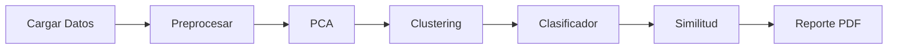

<p align="center">
  
</p>

<h1 align="center">
  <br>
  Chemometrics Helper
  <br>
</h1>

<h4 align="center">Sistema Interactivo de Análisis Multivariado para Datos Químicos</h4>

<p align="center">
  
  
  
  
  
  
</p>

<p align="center">
  <strong>Proyecto Académico | Tecnológico de Monterrey | Métodos Multivariados en Ciencia de Datos</strong>
</p>

<p align="center">
  <a href="#características">Características</a> •
  <a href="#instalación">Instalación</a> •
  <a href="#uso">Uso</a> •
  <a href="#api">API</a> •
  <a href="#autores">Autores</a>
</p>

---

## Descripción

**Chemometrics Helper** es una aplicación web interactiva diseñada para estudiantes y profesionales de química que permite realizar análisis de componentes principales (PCA), clustering, clasificación supervisada y búsqueda de similitud química — todo sin necesidad de programar.

La aplicación incluye un **modo enseñanza** integrado que guía al usuario paso a paso, explicando cada técnica y cómo interpretar los resultados.

---

## Características

<table>
<tr>
<td width="50%">

### Análisis Multivariado
- **PCA** con scores, loadings y biplot
- **Clustering** K-means y jerárquico
- Visualizaciones interactivas
- Exportación de resultados CSV

</td>
<td width="50%">

### Machine Learning
- **Clasificador supervisado** (RF, SVM, LR)
- Predicción de feedstock y concentración
- Métricas y matriz de confusión
- Importancia de variables

</td>
</tr>
<tr>
<td width="50%">

### Fingerprinting Químico
- Búsqueda de muestras similares
- Métricas: euclidiana y coseno
- Visualización en espacio PCA
- Interpretación automática

</td>
<td width="50%">

### Reportes Automáticos
- Generación de PDF profesional
- Interpretaciones en español
- Resumen ejecutivo
- Gráficos incluidos

</td>
</tr>
</table>

### Modo Enseñanza

Tutorial guiado integrado que explica cada sección de la aplicación con overlays interactivos, ideal para aprender quimiometría paso a paso.

---

## Stack Tecnológico

| Capa | Tecnologías |
|------|-------------|
| **Frontend** | React 18, TypeScript, Vite, TailwindCSS, Recharts |
| **Backend** | Python 3.10+, FastAPI, Pydantic |
| **ML/Data** | scikit-learn, pandas, numpy, scipy |
| **PDF** | ReportLab |

---

## Instalación

### Requisitos Previos

- Python 3.10+
- Node.js 18+
- npm o yarn

### 1. Clonar el Repositorio

```bash
git clone https://github.com/yosebitasgg/analisis-quimiometrico.git
cd analisis-quimiometrico
```

### 2. Configurar Backend

```bash
cd backend

# Crear entorno virtual
python -m venv venv

# Activar (Windows)
venv\Scripts\activate

# Activar (Linux/Mac)
source venv/bin/activate

# Instalar dependencias
pip install -r requirements.txt
```

### 3. Configurar Frontend

```bash
cd frontend

# Instalar dependencias
npm install
```

---

## Ejecución

### Terminal 1 - Backend

```bash
cd backend
venv\Scripts\activate
uvicorn app.main:app --reload --port 8000
```

### Terminal 2 - Frontend

```bash
cd frontend
npm run dev
```

### URLs

| Servicio | URL |
|----------|-----|
| **Aplicación** | http://localhost:5173 |
| **API Docs** | http://localhost:8000/docs |
| **API ReDoc** | http://localhost:8000/redoc |

---

## Uso

### Flujo de Trabajo Recomendado



### 1. Cargar Datos

- Sube un archivo CSV/Excel o usa el **dataset de ejemplo** (FAMEs)
- El sistema detecta automáticamente variables numéricas y categóricas

### 2. Preprocesamiento

- Selecciona las variables a analizar
- Configura el manejo de valores faltantes
- **Estandariza** los datos (recomendado para PCA)

### 3. Análisis PCA

- Calcula componentes principales
- Explora: Varianza, Scores, Loadings, Biplot, Correlación

### 4. Clustering

- Elige K-means o Jerárquico
- Usa el análisis de Silhouette para elegir k óptimo

### 5. Clasificador

- Entrena modelos para predecir feedstock/concentración
- Evalúa con matriz de confusión y métricas

### 6. Similitud

- Encuentra muestras con perfiles químicos parecidos
- Visualiza vecinos en el espacio PCA

### 7. Reporte

- Genera un PDF profesional con todas las interpretaciones

---

## API

### Endpoints Principales

<details>
<summary><b>Datos</b></summary>

| Método | Endpoint | Descripción |
|--------|----------|-------------|
| `POST` | `/api/data/upload` | Subir archivo CSV/Excel |
| `POST` | `/api/data/cargar-ejemplo` | Cargar dataset de ejemplo |
| `POST` | `/api/data/preprocesar` | Aplicar preprocesamiento |
| `GET` | `/api/data/correlacion/{session_id}` | Matriz de correlación |
| `GET` | `/api/data/exportar/{session_id}` | Exportar CSV |

</details>

<details>
<summary><b>PCA</b></summary>

| Método | Endpoint | Descripción |
|--------|----------|-------------|
| `POST` | `/api/pca/calcular` | Ejecutar PCA |
| `GET` | `/api/pca/resultados/{session_id}` | Obtener resultados |

</details>

<details>
<summary><b>Clustering</b></summary>

| Método | Endpoint | Descripción |
|--------|----------|-------------|
| `POST` | `/api/clustering/calcular` | Ejecutar clustering |
| `GET` | `/api/clustering/silhouette-analisis/{session_id}` | Análisis silhouette por k |
| `GET` | `/api/clustering/silhouette-muestras/{session_id}` | Silhouette por muestra |

</details>

<details>
<summary><b>Clasificador</b></summary>

| Método | Endpoint | Descripción |
|--------|----------|-------------|
| `POST` | `/api/classifier/train` | Entrenar modelo |
| `POST` | `/api/classifier/predict` | Predecir clases |
| `GET` | `/api/classifier/status/{session_id}` | Estado del modelo |

</details>

<details>
<summary><b>Similitud</b></summary>

| Método | Endpoint | Descripción |
|--------|----------|-------------|
| `POST` | `/api/similarity/search` | Buscar similares |
| `GET` | `/api/similarity/samples/{session_id}` | Listar muestras |

</details>

<details>
<summary><b>Reportes</b></summary>

| Método | Endpoint | Descripción |
|--------|----------|-------------|
| `GET` | `/api/report/summary/{session_id}` | Resumen del análisis |
| `GET` | `/api/report/pdf/{session_id}` | Descargar PDF |

</details>

---

## Estructura del Proyecto

```
chemometrics-helper/
|
+-- backend/
|   +-- app/
|   |   +-- main.py                 # FastAPI app
|   |   +-- routers/                # Endpoints
|   |   |   +-- data.py
|   |   |   +-- pca.py
|   |   |   +-- clustering.py
|   |   |   +-- classifier.py
|   |   |   +-- similarity.py
|   |   |   +-- report.py
|   |   +-- services/               # Lógica de negocio
|   |   +-- models/                 # Schemas Pydantic
|   +-- requirements.txt
|
+-- frontend/
|   +-- src/
|   |   +-- components/             # Componentes React
|   |   +-- pages/                  # Páginas
|   |   +-- context/                # Estado global
|   |   +-- api/                    # Clientes API
|   |   +-- types/                  # Tipos TypeScript
|   +-- package.json
|   +-- vite.config.ts
|
+-- data/
|   +-- chemometrics_example.xls    # Dataset de ejemplo
|
+-- README.md
```

---

## Dataset de Ejemplo

El archivo `data/chemometrics_example.xls` contiene datos de **FAMEs** (Fatty Acid Methyl Esters):

| Variable | Descripción |
|----------|-------------|
| **11 columnas numéricas** | Áreas de picos cromatográficos |
| **feedstock** | Materia prima (1-7) |
| **concentration** | Nivel de biodiesel (1-7) |

### Codificación de feedstock
| Código | Materia Prima |
|--------|--------------|
| 1 | Diesel |
| 2 | Animal Tallow (Texas) |
| 3 | Animal Tallow (IRE) |
| 4 | Canola |
| 5 | Waste Grease |
| 6 | Soybean |
| 7 | Desconocido |

### Codificación de concentration
| Código | Nivel |
|--------|-------|
| 1 | Diesel puro |
| 2 | B2 |
| 3 | B5 |
| 4 | B10 |
| 5 | B20 |
| 6 | B100 |
| 7 | Desconocida |

---

## Requisitos Cumplidos

| Requisito | Estado | Implementación |
|-----------|--------|----------------|
| Importar datos CSV/Excel | OK | DataLoaderCard con drag & drop |
| Preprocesamiento | OK | Selección variables, NaN, estandarización |
| PCA | OK | Scores, loadings, varianza, biplot |
| Clustering | OK | K-means, jerárquico, dendrograma |
| Visualizaciones interactivas | OK | Recharts con tooltips |
| Colorear por categorías | OK | Feedstock, concentration, cluster |
| Exportar resultados | OK | CSV con todos los datos |
| Ayuda en español | OK | Página de ayuda completa |
| Clasificador supervisado | OK | RF, SVM, Logistic Regression |
| Fingerprinting químico | OK | Búsqueda por similitud |
| Reportes PDF | OK | Generación automática |
| Modo enseñanza | OK | Tutorial guiado interactivo |

---

## Solución de Problemas

<details>
<summary><b>El backend no inicia</b></summary>

```bash
# Verificar entorno virtual activo
# Verificar dependencias instaladas
pip install -r requirements.txt

# Si el puerto está ocupado
uvicorn app.main:app --port 8001
```

</details>

<details>
<summary><b>Error de conexión frontend-backend</b></summary>

- Verificar que el backend corre en puerto 8000
- Revisar `vite.config.ts` para el proxy

</details>

<details>
<summary><b>Dataset de ejemplo no carga</b></summary>

- Verificar que existe `data/chemometrics_example.xls`
- Revisar ruta en `backend/app/services/data_service.py`

</details>

---

## Autores

<table>
<tr>
<td align="center">
<b>Yoseba Michel Mireles Ahumada</b><br>
<sub>A01612830</sub>
</td>
<td align="center">
<b>Luis Carlos Marrufo Padilla</b><br>
<sub>A01638980</sub>
</td>
</tr>
</table>

<p align="center">
<sub>Tecnológico de Monterrey - ITESM</sub>
</p>

---

## Licencia

Este proyecto es desarrollado con fines académicos para el curso de **Métodos Multivariados en Ciencia de Datos** del Tecnológico de Monterrey.

---


<p align="center">
  
  
</p>
